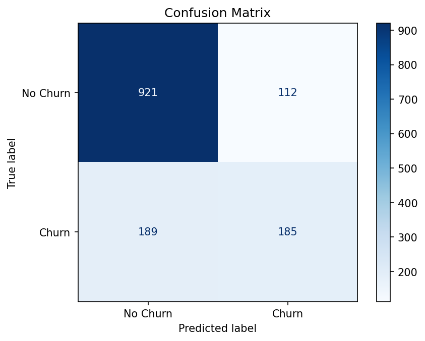
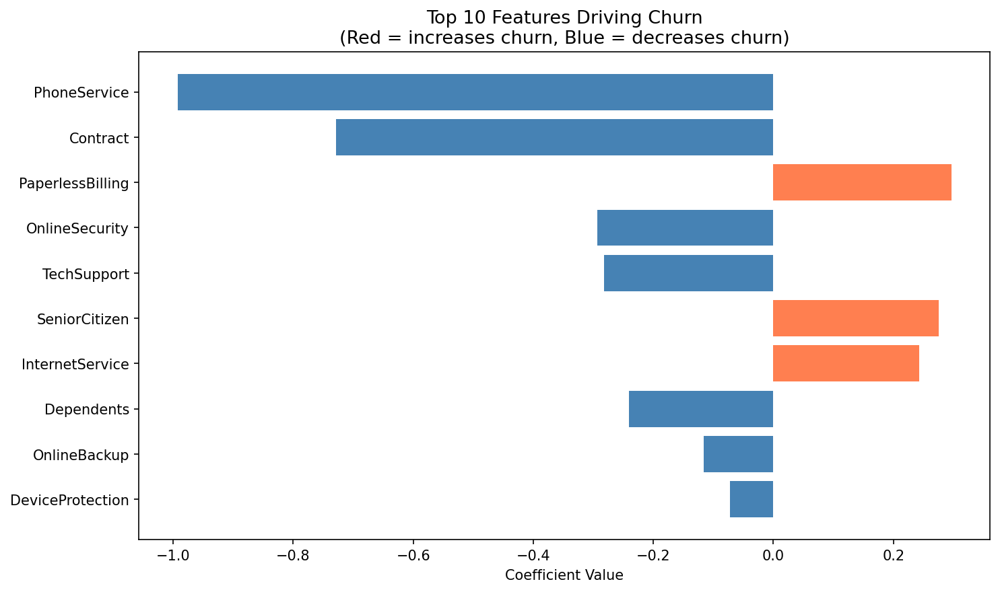

# Customer Churn Prediction - Logistic Regression

## Overview
Built a logistic regression model to predict customer churn for a telecom company using a dataset of 7,043 customers. The goal was to identify which customers are at risk of leaving so the business can intervene early with retention offers.

## Tools Used
Python (pandas, numpy, scikit-learn, matplotlib, seaborn), Jupyter Notebook

## Dataset
Telco Customer Churn dataset (Kaggle) — 7,043 customers, 21 features including contract type, services subscribed, tenure, and monthly charges.

## Model Performance
| Metric | Score |
|---|---|
| Accuracy | 79% |
| Precision (Churn) | 62% |
| Recall (Churn) | 49% |
| F1-Score (Churn) | 55% |

## Key Findings

- **Contract type is the strongest retention factor** — customers on longer contracts churn significantly less
- **PaperlessBilling customers churn more** — likely tech-savvy users who comparison shop
- **Senior citizens are at higher churn risk** — may need targeted pricing or support
- **Bundled services (TechSupport, OnlineSecurity) reduce churn** — customers who feel supported stay longer
- **112 at-risk customers were missed** by the model (false negatives) — further tuning could reduce this

## Business Recommendations
1. **Incentivize annual or two-year contracts** — the single biggest factor in reducing churn
2. **Target senior citizens with retention offers** — they show the highest churn risk
3. **Bundle TechSupport and OnlineSecurity into onboarding** — customers with these services are significantly more likely to stay
4. **Flag month-to-month customers with high monthly charges** as highest priority for proactive outreach

## Concepts Demonstrated
- Data cleaning and feature engineering
- Label encoding for categorical variables
- Train/test split and model evaluation
- Logistic regression with scikit-learn
- Confusion matrix interpretation
- Feature importance via model coefficients
- Business recommendations from model output
